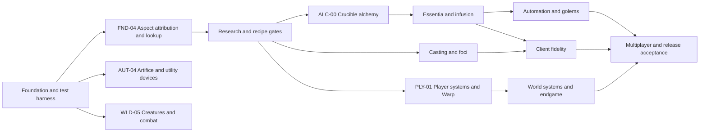

# Agent Pipeline

This directory is the control surface for turning the source tree into a full Thaumcraft 6.1.BETA26 parity port for Minecraft 1.20.1 Forge.

The pipeline is intentionally small:

| File | Purpose |
|---|---|
| `../../AGENTS.md` | mandatory operating rules for every coding agent |
| `active-claims.md` | sole current-owner record: claimed items, lane, owner, worktree or branch, intended paths, timestamps, dependency status, and release condition |
| `filesystem-map.md` | current repository layout, generated surfaces, and ownership boundaries |
| `parity-workboard.md` | ordered work items, dependencies, and definitions of done |
| `handoffs/` | archive of work-item handoffs for `ACTIVE`, `VERIFYING`, and `DONE` rows: rules and the exact field sequence in `handoffs/README.md`, with one immutable record per item (for example `handoffs/FND-03.md`) |
| `parity-evidence-index.md` | reference hierarchy and required proof for BETA26 parity claims |
| `deferred-issues.md` | budget-aware list of confirmed blockers and later verification work |
| `tc6-feature-matrix.md` | measures BETA26 parity coverage per feature group and names each group's owning work item or cross-lane rationale |
| `system-entrypoints.md` | per-item source, data, and test entry points for safe agent handoffs |
| `reference-catalog.md` | reproducible BETA26 observation metadata (reference identifiers, runtime versions, artifact paths, and SHA-256 values) without storing proprietary binaries or assets |
| `validation-matrix.md` | required validation tiers with commands or scenarios, evidence locations, clean-state requirements, and pass conditions |
| `budget-hold.md` | budget authority, allowed and prohibited activities, the reactivation condition, and the post-hold spending order |
| `../../tools/agent-pipeline/Update-FileSystemMap.ps1` | regenerates the factual portions of the filesystem map |
| `../../tools/agent-pipeline/Test-AgentPipeline.ps1` | local structural validator for pipeline files, map freshness, workboard IDs, dependency references, cycles, handoffs, and the budget-hold state, with no Gradle or game run |

## Workflow

1. The coordinator selects the next unblocked work item from the workboard.
2. The coordinator records the claim in `active-claims.md` before work starts.
3. A worker reads the applicable subsystem and the BETA26 reference behavior.
4. The worker makes one isolated repair with focused tests.
5. The worker returns a handoff with commands, runtime evidence, and follow-up dependencies.
6. The coordinator archives the handoff under `handoffs/<ID>.md` for `ACTIVE`, `VERIFYING`, and `DONE` states, records the result, and unlocks dependent work.

Agents should work on different lanes in parallel only when their file ownership and behavioral dependencies do not overlap. The primary dependency spine is:

Run the map updater after large moves, generated-data changes, or a major subsystem lands. The map is an orientation aid; source and runtime checks remain authoritative.
