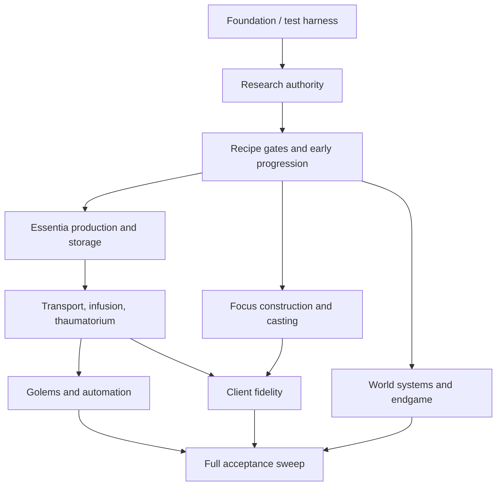

# Thaumcraft 6.1.BETA26 Parity Workboard

## Release Contract

- **Target:** Minecraft 1.20.1 Forge 47.3.0, Java 17.
- **Fidelity baseline:** Thaumcraft 6.1.BETA26 intended content, progression, balance, and behavior.
- **Quality bar:** a fresh survival world reaches all major systems without commands; systems survive save/reload and dedicated-server multiplayer; no known crash, dupe, data-loss, or progression deadlock remains.
- **Distribution:** private play only unless written permission allows a public modified build.

## State Key

`READY` means an agent may claim the item. `BLOCKED` names a prerequisite. `DEFERRED` means the item is intentionally paused by a project constraint. `ACTIVE`, `VERIFYING`, and `DONE` are coordinator-controlled states backed by a handoff and evidence.

## Budget Hold

Implementation is deferred while the project is budget-constrained. `FND-01` is the next item when work resumes; all other non-complete items remain dependency-blocked. See `deferred-issues.md` for the confirmed issue register and the order that makes the best use of the next development budget.

## Dependency Spine

## Foundation — `FND`

| ID | State | Outcome | Primary areas | Acceptance evidence | Handoff |
|---|---|---|---|---|---|
| FND-01 | DEFERRED: budget hold | Establish unit-test and GameTest conventions, fixtures, and a fresh-world/reload/server smoke suite. | `src/test/`, Gradle run configs | `test` contains tests; focused GameTests run; documented local command sequence passes. | — |
| FND-02 | BLOCKED: FND-01 | Audit every registered block entity, menu, renderer, capability, and packet against factory/ticker/side ownership. | `init/`, `common/blocks`, `common/tiles`, `common/lib` | Inventory names each missing or mismatched integration point; regressions have tests. | — |
| FND-03 | DONE | Created the BETA26 parity evidence index for systems under repair. | `docs/agent-pipeline/parity-evidence-index.md` | Reference hierarchy, evidence template, and initial evidence queue are documented. | handoffs/FND-03.md |

## Research and Early Progression — `RSR`

| ID | State | Outcome | Primary areas | Acceptance evidence | Handoff |
|---|---|---|---|---|---|
| RSR-01 | BLOCKED: FND-01 | Make scanning, stages, prerequisites, and knowledge persistence server-authoritative. | `api/research`, `common/lib/research`, capabilities, packets | Fresh player completes scan-gated entries; invalid client progress is rejected; reload preserves state. | — |
| RSR-02 | BLOCKED: RSR-01 | Enforce Arcane Workbench crystals, Vis, research gates, and atomic output consumption. | workbench menu/tile/recipes | Insufficient resources never craft; valid craft consumes exact resources across client/server. | — |
| RSR-03 | BLOCKED: RSR-01 | Validate the Thaumonomicon, research table/theorycrafting, and research-driven recipe discovery. | research menus/screens/data | Complete early-to-advanced progression works without commands. | — |

## Alchemy and Advanced Crafting — `ALC`

| ID | State | Outcome | Primary areas | Acceptance evidence | Handoff |
|---|---|---|---|---|---|
| ALC-01 | BLOCKED: FND-01 | Restore authoritative item aspects and smelter inputs. | aspect registry, smelter tiles | Valid items smelt into correct Essentia; invalid inputs do not consume items. | — |
| ALC-02 | BLOCKED: ALC-01 | Wire alembics, jars, tube variants, filters, and reload-safe Essentia transfer. | essentia blocks/tiles/capabilities | A survival-built line transports the expected aspect without loss/duplication after reload. | — |
| ALC-03 | BLOCKED: ALC-02 | Restore Infusion Matrix block entity, activation, pedestals, consumption, instability, and stabilizers. | crafting blocks/tiles, recipes | A normal infusion completes; instability and stabilizers match BETA26 intent. | — |
| ALC-04 | BLOCKED: ALC-03 | Restore Thaumatorium lookup, selection, and crafting. | Thaumatorium tile/menu/recipes | A researched recipe processes end-to-end using its required Essentia. | — |

## Casting — `CAS`

| ID | State | Outcome | Primary areas | Acceptance evidence | Handoff |
|---|---|---|---|---|---|
| CAS-01 | BLOCKED: FND-01 | Open the Focal Manipulator and preserve every focus-node setting. | manipulator block/menu/screen, focus NBT | A configured focus survives inventory movement and world reload. | — |
| CAS-02 | BLOCKED: CAS-01 | Execute focus graphs server-side for Touch, Bolt, projectile, cloud, mine, plan, modifiers, and effects. | `api/casters`, focus items, projectile entities, packets | Each delivery medium applies its configured effect exactly once with correct costs. | — |
| CAS-03 | BLOCKED: CAS-02 | Validate caster inventory, focus pouch, Vis costs, cooldowns, rendering, and multiplayer effects. | caster items, GUI, client FX | A player can craft/use/share foci without lost data or client/server divergence. | — |

## Automation — `AUT`

| ID | State | Outcome | Primary areas | Acceptance evidence | Handoff |
|---|---|---|---|---|---|
| AUT-01 | BLOCKED: FND-02 | Persist seals per level and restore the seal/logistics configuration UI. | golems, seals, bell, menus, packets | Seals survive reload and are fully configurable through the bell. | — |
| AUT-02 | BLOCKED: AUT-01 | Validate golem tasks, upgrades, ownership, inventories, and multiplayer behavior. | golem AI/tasks/entities | A configured golem completes representative BETA26 tasks after reload. | — |
| AUT-03 | BLOCKED: ALC-03 | Restore Pattern Crafter, Arcane Bore, and related automation devices. | automation blocks/tiles/entities | Each device consumes inputs and produces expected outputs without dupes. | — |

## World Systems — `WLD`

| ID | State | Outcome | Primary areas | Acceptance evidence | Handoff |
|---|---|---|---|---|---|
| WLD-01 | BLOCKED: FND-01 | Validate aura generation, Vis/Flux persistence, and dimension lifecycle. | `common/world/aura` | Fresh and reloaded worlds maintain stable aura values. | — |
| WLD-02 | BLOCKED: WLD-01 | Restore renewable Greatwood/Silverwood growth and worldgen parity. | saplings, features, biome modifiers | Saplings and generated features match intended behavior. | — |
| WLD-03 | BLOCKED: WLD-01 | Restore flux rifts, taint, stabilization, cleansing, and late-game consequences. | rift/taint entities, world blocks, devices | Rift lifecycle and taint behavior work in server and reload scenarios. | — |
| WLD-04 | BLOCKED: RSR-03 | Validate Eldritch progression, structures, bosses, and endgame unlocks. | structures, entities, research | A survival player reaches and completes the BETA26 endgame path. | — |

## Client Fidelity — `CLI`

| ID | State | Outcome | Primary areas | Acceptance evidence | Handoff |
|---|---|---|---|---|---|
| CLI-01 | BLOCKED: RSR-03 | Complete research, crafting, and device screens with correct server synchronization. | client screens/widgets/renderers | All core menus open and work without client-only state. | — |
| CLI-02 | BLOCKED: CAS-02 | Restore caster, beam, particle, and focus visuals. | client FX/particles/renderers | Effects are visible to nearby clients and do not crash dedicated servers. | — |
| CLI-03 | BLOCKED: WLD-04 | Replace placeholder/missing models, textures, sounds, and entity renders. | assets, models, renderers, `TEXTURETODO.md` | No core BETA26 content uses placeholder or missing assets. | — |

## Release Acceptance — `REL`

| ID | State | Outcome | Primary areas | Acceptance evidence | Handoff |
|---|---|---|---|---|---|
| REL-01 | BLOCKED: all gameplay lanes | Verify JEI/Curios contracts and configuration behavior. | compat, config, data | Supported combinations and optional behavior are documented and tested. | — |
| REL-02 | BLOCKED: all gameplay lanes | Run long-play, dedicated-server, remote-client, reload, performance, dupe, and crash sweeps. | full repository | All reported defects have reproduction/verification evidence; no open parity blockers remain. | — |
| REL-03 | BLOCKED: REL-02 | Produce private-play package and install guide. | build/docs | Reproducible JAR, exact versions, and clean install verification. | — |
| REL-04 | BLOCKED: written permission | Prepare public distribution materials only after rights are confirmed. | metadata/docs | Permission, attribution, license, and release channel are verified. | — |
